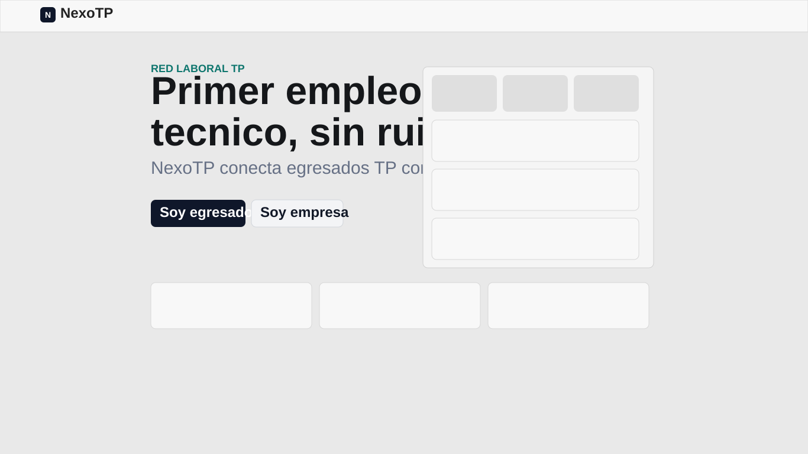

# NexoTP

Plataforma web en Flask para conectar egresados TP con empresas que publican ofertas laborales.



## Caracteristicas
- Registro e inicio de sesion para usuarios.
- Registro e inicio de sesion para empresas.
- Publicacion de ofertas por empresa.
- Postulacion de usuarios a ofertas activas.
- Panel de empresa con gestion de postulaciones.
- Seguridad de acceso por empresa: cada empresa solo puede gestionar sus propias postulaciones.
- Filtros avanzados en panel de empresa: estado, oferta, modalidad, jornada, especialidad, busqueda de texto, fecha desde y fecha hasta.
- Panel administrador para gestion global.

## Stack tecnico
- Python 3.14+
- Flask
- Flask-SQLAlchemy
- Flask-Login
- SQLite (local)

## Estructura del proyecto
```text
NexoTP/
  app.py
  requirements.txt
  templates/
  static/
    css/
    js/
  instance/
  docs/
  screenshots/
```

## Ejecucion local
```bash
python -m pip install -r requirements.txt
python app.py
```
Abrir: `http://localhost:5000`

## Variables de entorno
- `SECRET_KEY`: clave de sesion Flask.
- `ADMIN_PASSWORD`: password de acceso al panel admin (`/admin-nexotp`).
- `FLASK_DEBUG`: usar `1` para debug local.

Ejemplo PowerShell:
```powershell
$env:SECRET_KEY="cambia-esto"
$env:ADMIN_PASSWORD="cambia-esto"
python app.py
```

## Flujo funcional
1. Usuario se registra/inicia sesion.
2. Empresa publica ofertas.
3. Usuario postula.
4. Empresa revisa en `/empresa/panel` y decide aceptar/rechazar.
5. Sistema guarda actividad en novedades.

## Seguridad aplicada en postulaciones de empresa
- El endpoint de cambio de estado valida que la postulacion pertenezca a una oferta de la empresa autenticada.
- El listado del panel de empresa se obtiene desde query filtrada por `empresa_id`.

## Deploy recomendado (100% nube)
Ver guia completa en [docs/DEPLOY_RENDER.md](docs/DEPLOY_RENDER.md).

Resumen:
1. Subir repo a GitHub.
2. Crear Web Service en Render.
3. Configurar `Start Command`: `gunicorn app:app`.
4. Configurar Postgres administrado y `DATABASE_URL`.

## Capturas
- Referencia home: [screenshots/home-referencial.svg](screenshots/home-referencial.svg)

## Estado del repo
- Repositorio git local creado.
- Commit inicial creado.
- Pendiente: crear repo remoto en GitHub y hacer `push`.

## Licencia
Uso academico / proyecto demostrativo.
